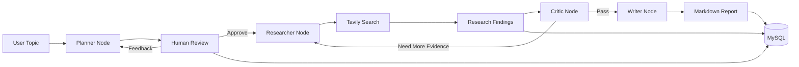

# DeepInsight Agent

**Autonomous Deep Research & Intelligence Agent with LangGraph, Tavily, MySQL, and Streamlit.**

DeepInsight Agent turns a research topic into a structured, source-backed Markdown report. It plans the research, pauses for human approval, searches real web sources, critiques evidence quality, writes the final report, and persists the full run history to MySQL.

This project is designed as a portfolio-grade AI engineering project: not a single prompt wrapper, but a stateful multi-step agent workflow with Human-in-the-Loop review, retrieval, persistence, multilingual output, and an interactive UI.

## Highlights

- **LangGraph workflow orchestration** with explicit planner, researcher, critic, and writer nodes.
- **Human-in-the-Loop approval** before web research begins.
- **Real web retrieval** through Tavily Search.
- **Provider-flexible LLM layer** supporting demo mode, OpenAI, and Gemini.
- **Low-quota development mode** for stable testing without paid LLM calls.
- **MySQL persistence** for runs, outlines, findings, sources, reports, and statuses.
- **Streamlit dashboard** for outline review, feedback, report generation, and run history.
- **English and Vietnamese output** through `report_language`.
- **Test coverage** for graph execution, resume flow, provider validation, and database config.

## Demo Flow

```text
User enters topic
  -> Planner creates outline
  -> MySQL saves run as awaiting_human
  -> User approves or edits outline
  -> Researcher searches Tavily sources
  -> Critic checks evidence quality
  -> Writer generates Markdown report
  -> MySQL saves completed run, findings, sources, and output path
```

Example topics:

```text
AI adoption barriers and practical use cases for Vietnamese SMEs in 2025
```

```text
Rào cản và cơ hội ứng dụng Computer Vision trong kiểm tra chất lượng sản phẩm tại các nhà máy SME Việt Nam
```

## Architecture



## Tech Stack

| Area | Tools |
| --- | --- |
| Agent orchestration | LangGraph |
| LLM abstraction | LangChain, OpenAI, Gemini |
| Web research | Tavily Search API |
| Persistence | MySQL |
| UI | Streamlit |
| Config | Pydantic Settings, python-dotenv |
| Output | Markdown |
| Testing | pytest |

## Project Structure

```text
DeepInsight-Agent/
  app/
    graph.py                 # LangGraph workflows
    state.py                 # Shared AgentState schema
    main.py                  # Direct CLI run
    hitl_cli.py              # Human-in-the-Loop CLI
    init_db.py               # MySQL schema initialization
    nodes/
      planner.py
      researcher.py
      critic.py
      writer.py
    services/
      llm.py                 # Demo/OpenAI/Gemini adapters
      search.py              # Tavily/demo search adapter
      database.py            # MySQL persistence layer
      pdf_exporter.py        # Markdown output placeholder
  db/
    schema.sql
  tests/
  ui/
    streamlit_app.py
  outputs/
    .gitkeep
```

## Quick Start

### 1. Create Environment

```bash
python3.12 -m venv .venv
source .venv/bin/activate
pip install -r requirements.txt
cp .env.example .env
```

### 2. Run Tests

```bash
python -m pytest tests
```

Expected:

```text
7 passed
```

### 3. Run in Low-Quota Mode

Low-quota mode uses Tavily for real search while keeping LLM behavior deterministic.

In `.env`:

```bash
LLM_PROVIDER=demo
TAVILY_API_KEY=your_tavily_key
```

Run:

```bash
python -m app.main "AI adoption trends in Vietnamese SMEs" --depth quick
```

## Human-in-the-Loop CLI

Run:

```bash
python -m app.hitl_cli "AI adoption trends in Vietnamese SMEs" --depth quick
```

Vietnamese output:

```bash
python -m app.hitl_cli "Rào cản ứng dụng AI trong doanh nghiệp SME Việt Nam" --depth quick --language vi
```

The CLI will:

1. Generate an outline.
2. Save the run as `awaiting_human`.
3. Ask for approval or feedback.
4. Resume from research after approval.
5. Save the completed report to MySQL and `outputs/`.

## Streamlit Dashboard

Run:

```bash
streamlit run ui/streamlit_app.py
```

Open:

```text
http://localhost:8501
```

The dashboard supports:

- Topic input
- Research depth selection
- English/Vietnamese report selection
- Outline generation
- Feedback loop
- Approve & Research action
- Markdown report preview
- Markdown download
- Recent MySQL run history

## MySQL Setup

Create the local schema:

```bash
python -m app.init_db
```

Or run manually in MySQL Workbench:

```sql
source db/schema.sql;
```

Enable MySQL persistence in `.env`:

```bash
MYSQL_ENABLED=true
MYSQL_HOST=127.0.0.1
MYSQL_PORT=3306
MYSQL_USER=root
MYSQL_PASSWORD=your_mysql_password
MYSQL_DATABASE=deepinsight_agent
```

Core tables:

| Table | Purpose |
| --- | --- |
| `research_runs` | Stores topic, depth, status, outline, report, output path |
| `research_findings` | Stores section-level evidence summaries |
| `research_sources` | Stores source title, URL, snippet, and Tavily score |

## LLM Provider Configuration

Demo mode:

```bash
LLM_PROVIDER=demo
```

OpenAI:

```bash
LLM_PROVIDER=openai
OPENAI_API_KEY=your_openai_key
OPENAI_MODEL=gpt-4.1-mini
```

Gemini:

```bash
LLM_PROVIDER=gemini
GOOGLE_API_KEY=your_google_key
GEMINI_MODEL=gemini-3.6-flash
GEMINI_FALLBACK_MODELS=
```

Tavily:

```bash
TAVILY_API_KEY=your_tavily_key
TAVILY_MAX_RESULTS=5
```

## Why LangGraph?

| Naive chain | LangGraph workflow |
| --- | --- |
| Linear and hard to pause | Explicit stateful graph |
| Difficult to resume | Resume from approved outline |
| Weak control over loops | Conditional critic-to-researcher loop |
| Hidden intermediate state | Typed `AgentState` shared across nodes |
| Hard to add HITL | Human approval becomes a first-class workflow step |

LangGraph is a good fit here because the agent is not just generating text. It has a lifecycle: planning, approval, retrieval, critique, writing, and persistence.

## Testing

Run all tests:

```bash
python -m pytest tests
```

Run syntax check:

```bash
python -m compileall app tests ui
```

Current tested areas:

- End-to-end graph smoke execution
- Resume graph after planning
- Vietnamese report generation
- Provider API key validation
- Database config behavior

## Security Notes

- `.env` is ignored and must never be committed.
- `.env.example` is safe to commit and contains no real secrets.
- Generated reports under `outputs/*.md` are ignored.
- Local virtual environments, caches, logs, and database files are ignored.

## Current Limitations

- PDF export is currently represented by Markdown output persistence.
- Native LangGraph checkpointing is not yet connected to MySQL; persistence is implemented at the application layer.
- Real LLM quality depends on provider quota and billing. `LLM_PROVIDER=demo` is recommended for stable local testing.

## Roadmap

- Add polished PDF export.
- Add Docker and Docker Compose.
- Add LangSmith tracing screenshots and cost/latency tracking.
- Add richer source ranking and citation formatting.
- Add production-style authentication for shared demos.

## License

This project is intended for learning, portfolio, and demonstration purposes.
